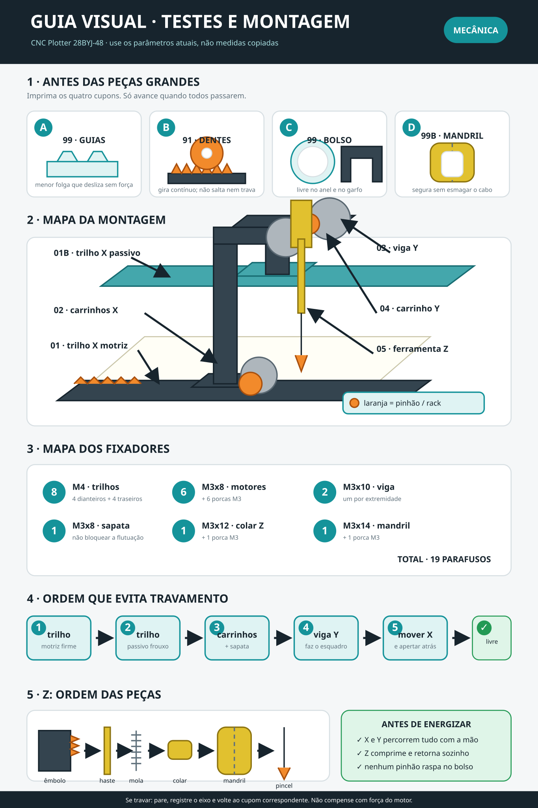

# Guia visual de testes e montagem

## Como usar

1. Comece pelos quatro cupons da primeira faixa.
2. Só imprima as peças longas depois que os quatro estiverem aprovados.
3. Monte seguindo a sequência numerada; o trilho traseiro só recebe o aperto
   final depois que o pórtico estiver correndo livre.
4. Confira o mapa dos fixadores antes de apertar qualquer subconjunto.
5. Faça o controle manual mostrado no quadro verde antes de energizar.

As dimensões continuam centralizadas em `00_Parametros.scad`. O infográfico
mostra relações, posição e ordem de montagem, portanto continua válido após
uma recalibração de folgas.

Para critérios detalhados de aprovação, diagnóstico e registro dos resultados,
consulte [`GUIA_TESTES_E_MONTAGEM.md`](GUIA_TESTES_E_MONTAGEM.md).
